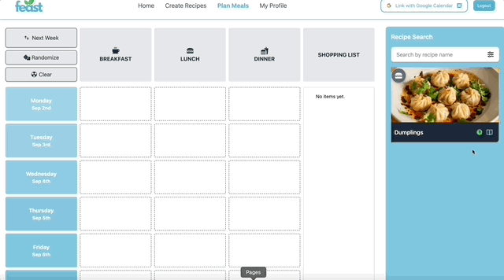

# React + Vite

## Feast Frontend

The Feast frontend is a React-based web application that allows users to plan meals, manage recipes, and schedule events on their Google Calendar. It provides an intuitive user interface for creating, editing, and scheduling recipes, as well as generating shopping lists based on the selected meals.

### Key Features

#### 1. Meal Planning:

Plan your weekly meals by scheduling recipes with custom meal times.

#### 2. Recipe Management:

Add, edit, and manage your recipes, including detailed ingredients and instructions.

#### 3. Shopping List Generation:

Automatically generate shopping lists based on scheduled meals.

#### 4. Google Calendar Integration:

Seamlessly schedule your meals on Google Calendar with calculated start and end times.

#### 5. Currency Conversion:

Convert ingredient costs into different currencies using real-time exchange rates.

### Technologies Used

- **React:** For building the user interface.
- **Zustand:** State management for handling recipe and meal plan data.
- **NextUI:** For UI components and styling.
- **TanStack React Query:** For data fetching and asynchronous state management.
- **Date-fns:** For date manipulation and formatting.
- **Spoonacular API:** For fetching detailed ingredient information and estimated costs.
